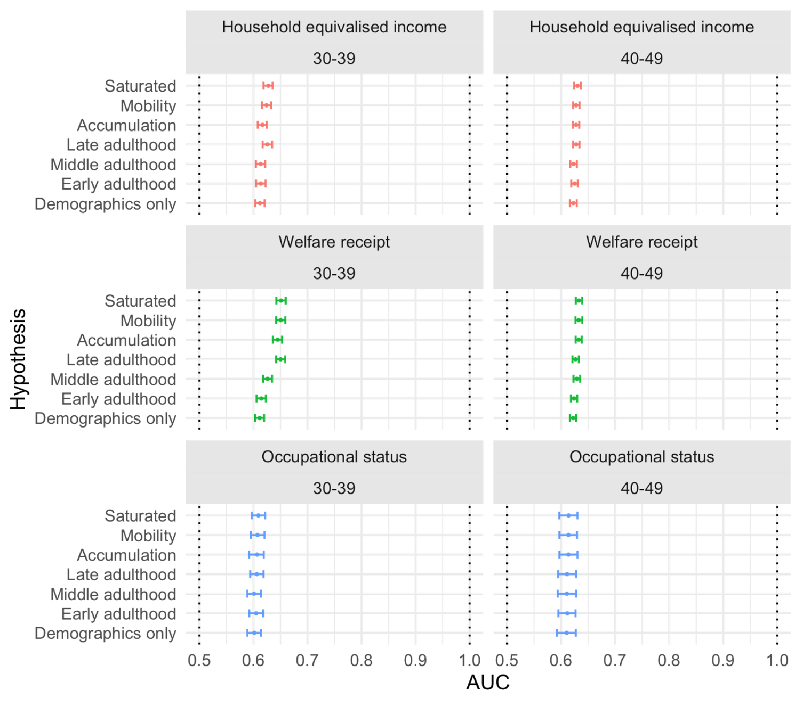
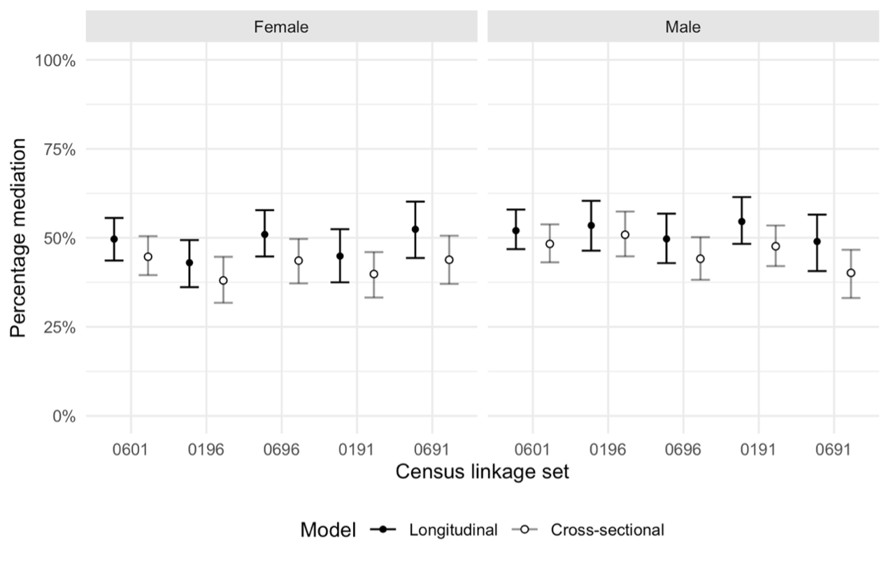
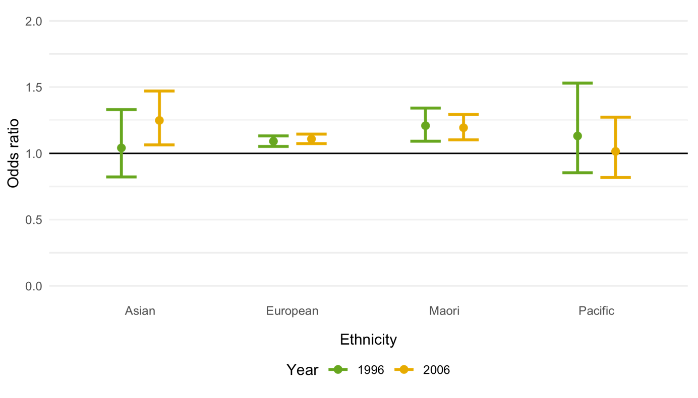
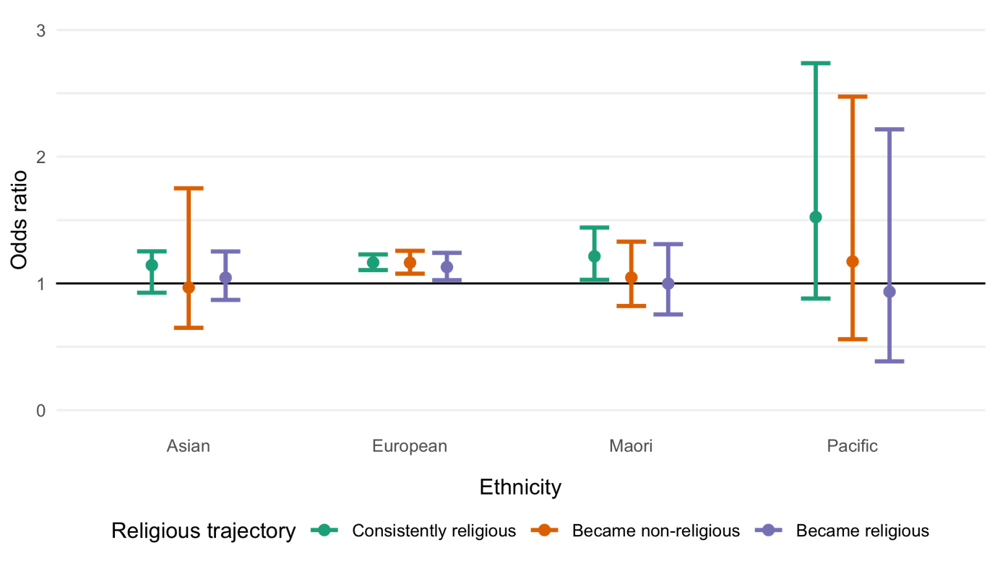
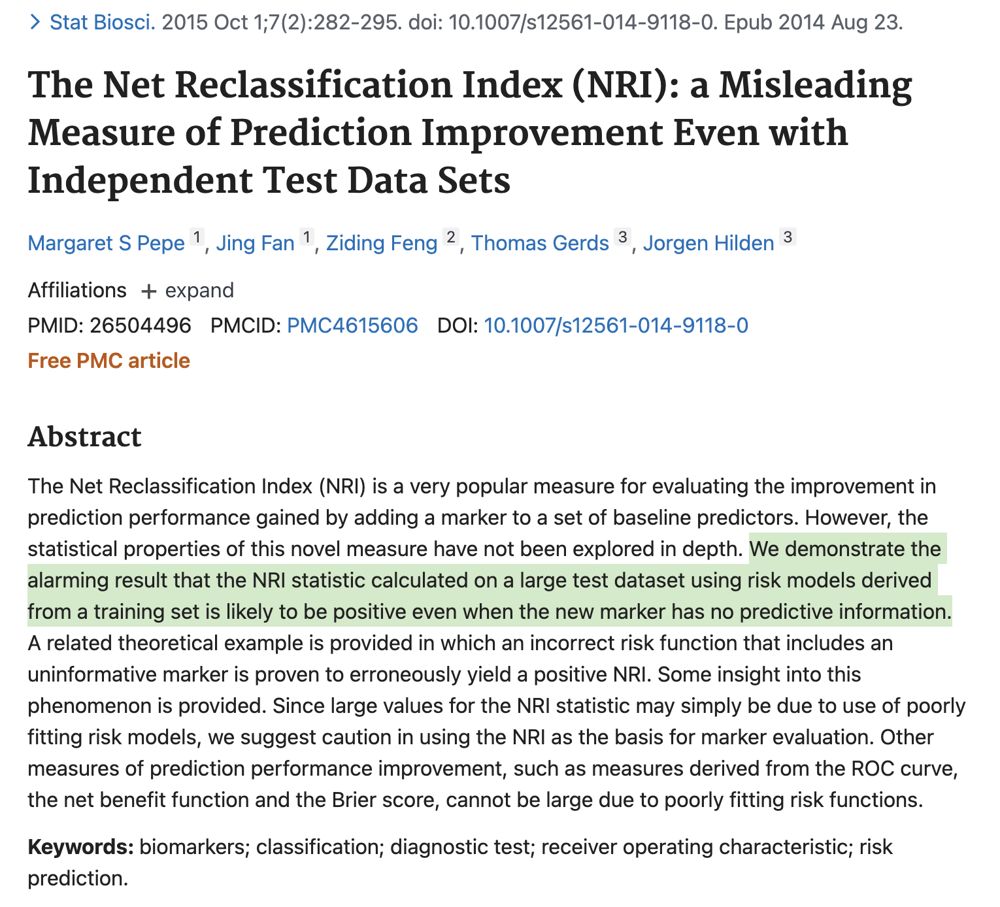

class: inverse, middle, center, hide-count
count: false
name: title

```{r setup, echo=FALSE, message=F}
library(xaringanExtra)


# Set up easy-copy code w/Xaringan extra
htmltools::tagList(
  xaringanExtra::use_clipboard(
    button_text = "<i class=\"fa fa-clipboard\"></i>",
    success_text = "<i class=\"fa fa-check\" style=\"color: #90BE6D\"></i>",
  ),
  rmarkdown::html_dependency_font_awesome()
)


xaringanExtra::use_banner(
  #top_left = "Longitudinal predictors of mortality inequalities in Aotearoa New Zealand",
  #top_right = "Liza Bolton",
  bottom_left ="link.lizabolton.com/defense",
  exclude = "title-slide"
)

# For additional CSS shortcuts
xaringanExtra::use_tachyons()

# Start GIFs at the beginning
xaringanExtra::use_freezeframe()

# Panels
xaringanExtra::use_panelset()

# Tileview
xaringanExtra::use_tile_view()

```


# Longitudinal predictors of mortality inequalities in Aotearoa New Zealand
<br>
### Elizabeth (Liza) Lillian Bolton

Supervised by Thomas Lumley and Barry Milne, with thanks to Alan Lee, Chris Wilde and Andrew Sporle

##### 2023-10-12


---
## .lightpurple[<i class="fa-solid fa-handshake"></i>] Mihi | Greetings

.pull-left.midi[Tēnā koutou katoa. 

Ko .purple[**Uropi**] me .purple[**Kanata**] te whakapaparanga mai.

Ko .purple[**Te Awamutu**] te whenua tupu.  

Ko .purple[**O-tāwhao**] te mārae.  

Ko .purple[**Tāmaki Makaurau**] te kāinga.  

Ko .purple[**Liza**] taku ingoa.  

Tēnā tātou katoa.  
]


.pull-right.midi[
Greetings everyone.  

My origins are in .purple[**Europe**] and .purple[**Canada**].  

I grew up in .purple[**Te Awamutu**].  

My mārae is .purple[**O-Tāwhao**].

My home is .purple[**Auckland**].  

My name is .purple[**Liza**].  

Greetings all.
] 


---
## .lightpurple[<i class="fa-solid fa-right-long"></i>] Motivation

.midi[
.column[
.lightpurple.verylarge.center[<i class="fa-solid fa-hospital"></i>]

Socioeconomic inequalities in mortality are well established and governments consider this in policy.

.large.purple[Socioeconomic position (SEP)] is a measure of social and/or economic resources and the associated social status.
]

.column[
.lightpurple.verylarge.center[<i class="fa-solid fa-down-long"></i>]

.large.purple[Ethnic inequalities persist] even as all-cause mortality rates are decreasing  in Aotearoa New Zealand. 

.large.purple[40–50%] of Māori / European mortality inequalities can be explained by differing social and economic conditions. 
]

.middle.column[
.lightpurple.verylarge.center[<i class="fa-solid fa-scroll"></i>]

The Crown is in breach of its obligations under .large.purple[te Tiriti o Waitangi] with respect to health outcomes for Māori. Redressing disparities in SEP is fundamental to health equity obligations.
.myref[(Waitangi Tribunal, 2019)]
]

]


Repeated measures and life-course information about .highlight[.purple[socioeconomic position (SEP)]] may identify crucial exposures and exposure patterns/periods, explain more of the inequalities between ethnic groups, and establish whether social and cultural capital can protect against exposure to socioeconomic risk factors.

First point: Blakely et al., 2017, 2018; Disney et al., 2017; Heslop et al., 2001; Kinge et al., 2019; Marmot & Bell, 2016; Mishra et al., 2013; Padyab et al., 2013; Teng, Atkinson, Disney, Wilson, & Blakely, 2016, Ministry of Health, 2015 

Second point: (Disney et al., 2017)
Since the 1980s, between 40% and 50% of the difference between working-ages Māori and European people can be explained by differing social and economic conditions.  
(Blakely et al., 2018)

---
class: inverse, middle
## <i class="fa-solid fa-image"></i> The big picture

.column[
.verylarge.center[<i class="fa-solid fa-up-down"></i>]
- Persistent (ethnic) disparities in mortality
- Longitudinal associations between socioeconomic position and mortality *not* established
]

.column[
.verylarge.center[<i class="fa-solid fa-table"></i>]

- Data: Census data collected every five years between 1981 and 2006, linked to mortality records
- Research questions: **life-course hypotheses**, **mediation of disparities** between Māori and Europeans, and **religious affiliation and mortality** 
]

.column[
.verylarge.center[<i class="fa-solid fa-magnifying-glass-chart"></i>]

- Lower SEP is consistently associated with higher mortality across various indicators and cohorts
- Measurements at a **single point before mortality follow-up** were often as effective at predicting or mediating mortality
]

---
## .lightpurple[<i class="fa-solid fa-list-check"></i>] Objectives

Use repeated measures over time to better understand the association between socioeconomic position (SEP) and mortality. Specifically:
1.	To test support for .highlight[life-course hypotheses]—*accumulation*, *sensitive period*, and *mobility*—for multiple SEP indicators. 
2.	To assess the extent to which more/harsher experiences of deprivation over time .highlight[explain mortality inequalities] between the two largest ethnic groups, European settlers and Indigenous Māori.
3.	To test whether .highlight[religious affiliation], as an indicator of social/cultural capital, protects against low SEP.

To support these analyses: assess the validity of missed census-to-census weights.

---
## .lightpurple[<i class="fa-solid fa-table"></i>] Data

The .purple[New Zealand Longitudinal Census **(NZLC)**] links the 1981, 1986, 1991, 1996, 2001 and 2006 New Zealand Censuses of Population and Dwellings. The .purple[New Zealand Census-Mortality Study **(NZCMS)**] links mortality records to these censuses.

.midsmall[
.pull-left[
#### Funding

My thesis was developed in the context of a 2014–2017 Health Research Council grant won by a team led by Peter Davis (PI). 

#### Ethics
It was subject to approval from The University of Auckland Human Participants Ethics Committee (reference 012400). 
]
]
.pull-right[
<div class="emphasis-box" style="font-size: 21px">
<h4> Tatauranga Aotearoa | Stats New Zealand Data Disclaimer </h4>
<small>
<p>Access to the data used in this study was provided by Statistics New Zealand under conditions designed to give effect to the security and confidentiality provisions of the Statistics Act 2022. The results presented in this study are the work of the author, not Statistics New Zealand.</p>

<p>These results are not official statistics. They have been created for research purposes from the New Zealand Longitudinal Census and New Zealand Census Mortality-Study which are carefully managed by Stats NZ. For more information about Stats NZ’s integrated data please visit https://www.stats.govt.nz/integrated-data/. <p></small>
</div>
]

---
class: inverse, middle
## <i class="fa-solid fa-arrow-trend-up"></i> Life-course hypotheses

.purple.large.highlight[Which life-course hypotheses, out of **accumulation**, **sensitive period**, and **mobility**, best explain the relationship between SEP and mortality in Aotearoa New Zealand?]

---
## .lightpurple[<i class="fa-solid fa-arrow-trend-up"></i>] Life-course hypotheses

.pull-left.midi[
### Background
Established approaches to comparing trajectories using goodness of fit tests .myref[(Mishra et al., 2008)].

### Variables
**Mortality**: 5-years post census 2006 
**Demographic**: Age (30–49), sex, ethnicity   
**SEP**: Household equivalised income, welfare receipt and occupational status (dichotomised)
]

.pull-right.midi[
### Methods

For each SEP indicator:
- Logistic regression models for each life-course hypothesis, demographics only and saturated trajectories   
- ROC curves calculated + associated AUC  
- AUC confidence intervals bootstrapped

#### Features
- Sensitivity design:
  - Adjacent age groups
  - Sex
- Multiple SEP measures compared: Welfare, household income and occupational status
]


---
## .lightpurple[<i class="fa-solid fa-arrow-trend-up"></i>] Life-course hypotheses
### Socioeconomic position trajectories
<style>
  .spacer {
     margin-bottom: 1cm;
  }
</style>
<p class=".spacer">
</p>
.midsmall[
<table>
 <caption style="text-align:left">Table 1: The classification of each SEP trajectory under different life-course hypotheses. &nbsp</caption>
    <tr>
        <th>Trajectory</th>
        <th>Accumulation</th>
        <th>Early adulthood</th>
        <th>Middle adulthood</th>
        <th>Late adulthood</th>
        <th>Social mobility</th>
    </tr>
    <tr>
        <th>High-High-High</th>
        <td>0</td>
        <td>0</td>
        <td>0</td>
        <td>0</td>
        <td>Stable high</td>
    </tr>
    <tr>
        <th>High-High-Low</th>
        <td>1</td>
        <td>0</td>
        <td>0</td>
        <td>1</td>
        <td>Down</td>
    </tr>
    <tr>
        <th>High-Low-High</th>
        <td>1</td>
        <td>0</td>
        <td>1</td>
        <td>0</td>
        <td>Variable</td>
    </tr>
    <tr>
        <th>High-Low-Low</th>
        <td>2</td>
        <td>0</td>
        <td>1</td>
        <td>1</td>
        <td>Down</td>
    </tr>
    <tr>
        <th>Low-High-High</th>
        <td>1</td>
        <td>1</td>
        <td>0</td>
        <td>0</td>
        <td>Up</td>
    </tr>
    <tr>
        <th>Low-High-Low</th>
        <td>2</td>
        <td>1</td>
        <td>0</td>
        <td>1</td>
        <td>Variable</td>
    </tr>
    <tr>
        <th>Low-Low-High</th>
        <td>2</td>
        <td>1</td>
        <td>1</td>
        <td>0</td>
        <td>Up</td>
    </tr>
    <tr>
        <th>Low-Low-Low</th>
        <td>3</td>
        <td>1</td>
        <td>1</td>
        <td>1</td>
        <td>Stable low</td>
    </tr>
</table>

]

---
## .lightpurple[<i class="fa-solid fa-arrow-trend-up"></i>] Life-course hypotheses

.left-code[
### Results

Calculations of the area under the ROC curve (AUC) indicate how well the model classifies, specificially: if you were to randomly select two individuals, one who died and one who didn't, how likely would the model be to correctly order them so the individual who did die has a higher predicted probability.
]

.right-plot[
```{r, echo=F, out.width="85%"}

```
]

---
## .lightpurple[<i class="fa-solid fa-arrow-trend-up"></i>] Life-course hypotheses
### Conclusions

<div class="emphasis-box">
.large.purple[Lower SEP] is consistently significantly associated with .large.purple[higher mortality]. 
<br><br>
However, most of the life-course hypothesis and SEP indicator combinations across adulthood I tested .large.purple[do not improve classification of mortality outcomes], based on AUC. 
<br><br>
Where they do, measures of SEP at a .large.purple[single point directly before mortality follow-up] are sufficient.
</div>


---
class: inverse, middle
## <i class="fa-solid fa-diagram-project"></i> Mediation

.purple.large.highlight[Do repeated measures of SEP mediate the relationship between ethnicity and mortality more than single measures do?]

---
## .lightpurple[<i class="fa-solid fa-diagram-project"></i>] Mediation

.pull-left.midi[
### Background
- Mediation analyses quantify causal pathways.
- 40—50% of the difference in mortality outcomes between Māori and Europeans across the 1980s, 1990s and 2000s explained by differences in SEP (cross-sectional). .myref[(Blakely, et al., 2018)]

### Variables
**Mortality**: 5-years post census 1996 & 2006  
**Demographic**: 5-year age groups, sex, ethinicity (European only individuals and Māori individuals)  
**Socioeconomic**: Education, household equivalised income, welfare, labour force status, occupational status, deprivation

]

.pull-right.midi[
### Methods

- Fit logistic regression with interactions between ethnicity and all other variables
- Use the original data and a .large.purple['cross-world'] version of the data where, counterfacutally, Māori have European covariate distributions to predict age adjusted mortality rates for Māori, Europeans and 'cross-world' Māori

#### Features
- Compares single & repeated measures of SEP
- **Cohorts of different census linkages**: five census linkage sets separated by two sexes. 

]

---
## .lightpurple[<i class="fa-solid fa-diagram-project"></i>] Mediation

### Results

.center[
```{r, echo=F, out.width="70%", caption = "Percentage mediated with longitudinal and cross-sectional (latest census only) measures of SEP, by sex and linkage cohort."}

```
]


---
## .lightpurple[<i class="fa-solid fa-diagram-project"></i>] Mediation

### Conclusions

- Point estimates for the percentage mediated were consistently higher with repeated measures, but not practically significantly.
- .purple[**Possible sex-differential survivorship bias**]: While all estimates for males and females in the same linkage cohort overlap, for cohorts with only two links females had lower estimated mediation than males. For cohorts with more repeated measures (i.e., more censuses linked) this relationship reverses somewhat with generally more mediation for females.  

<div class="emphasis-box">.purple[**40–50%**] of the mortality inequalities between Māori and European New Zealanders in the 2000s were explained by SEP, .purple[**regardless of whether SEP was measured at a single point or repeated measures over time**].</div>


---
class: inverse, middle
## <i class="fa-solid fa-place-of-worship"></i> Religious affiliation

.purple.large.highlight[Does religious affiliation, as an indicator of social and cultural capital, protect against socioeconomic risk factors?]

---
## .lightpurple[<i class="fa-solid fa-place-of-worship"></i>] Religious affiliation

.pull-left.midi[
### Background
Religion is a known social determinant of mortality, though the nature of this relationship varies with the measure of religiosity. 


### Variables
**Mortality**: 3-years after 1996, 2006  
**Religious affiliation**: As at 1996/2006, or trajectory between 1996 & 2006 (missing values imputed)   
**Demographic**: Sex, 5-year age group, ethnicity, born in NZ, rurality  
**Economic**: Education, household equivalised income, labour force status  
**Health**: Invalid's benefit receipt, disability status

]

.pull-right.midi[
### Methods

- Logistic regression with sequential addition of demographic, economic and health variables.
- Ethnicity specific models with all demographic, economic and health variables.

#### Features

- Sensitivity to imputation for religious affiliation analysed

]

---
## .lightpurple[<i class="fa-solid fa-place-of-worship"></i>] Religious affiliation

### Results: Cross-sectional

.center[
```{r, echo=F, out.width="73%"}

```
]

---
## .lightpurple[<i class="fa-solid fa-place-of-worship"></i>] Religious affiliation

### Results: Longitudinal

.center[
```{r, echo=F, out.width="73%"}

```
]


---
## .lightpurple[<i class="fa-solid fa-diagram-project"></i>] Religious affiliation

### Conclusions

- **European**: Religious affiliation associated with ~10–15% higher odds of mortality after controlling for demographic, economic and health variables, with the of the exception 'became religious' longitudinal group 
- **Māori**: ~20% higher odds of mortality in 1996 and 2006
- **Asian**: Religious affiliation in 1996 was not associated with different odds of mortality, but religious affiliation in 2006 was associated with ~20% higher odds of mortality 
- **Pacific**: No signficiant associations

<div class="emphasis-box">
.purple[**No evidence of protective effects**] of religious affiliation.  
<br></br>
Either no detected difference or .purple[**significantly higher odds of mortality**] for the religiously affiliated.</div>


---
class: inverse, middle
## <i class="fa-solid fa-scale-unbalanced"></i> Weighting for missed census-to-census links

.purple.large.highlight[Are the findings from these studies robust to available weights that aim to account for missed census-to-census links? Are these weights valid?]


---
## .lightpurple[<i class="fa-solid fa-scale-unbalanced"></i>] NZ Longitudinal Census linkage weight case studies


.pull-left[
- The NZCMS weights for missed census-to-.purple[**mortality**] links
- Developed, but not validated: NZLC weights for missed census-to-.purple[***census***] links
]
.pull-right[

- Results from both weighting systems broadly .purple[**consistent**]
- Behaviours consistent with what we would expect if the weights are .purple[**accounting for some bias**] introduced based on missed census-to-census links
]
<br>
<div class="emphasis-box">Weights proposed to account for missed census-to-census links in the NZLC do appear to .purple[**reduce bias**]. However, when applied to the analyses in this thesis there were no practical changes to the conclusions. This may be because these models adjust for many of the same variables used to calculate the weights.</div>


---
class: inverse, middle, hide-count
count: false
# <i class="fa-solid fa-bullhorn"></i> Discussion


---
## .lightpurple[<i class="fa-solid fa-bullhorn"></i>] Discussion

.pull-left.midi[
### Strengths
- Comparison of cross-sectional and repeated measures
- Exploration of sex and ethnicity
- Limited recall error & low undercount
- Population coverage

### Limitations
- Adult SEP only (not childhood SEP)
- Restriction to theoretical population (no recent migrants)
- Survivorship bias
- Small counts for Asian & Pacific communities
]

.pull-right.midi[
### Implications
- Addressing SEP fundamental to health equity and meeting Tiriti obligations.
- Repeated census-based measures of SEP added surprisingly little to prediction and mediation of mortality outcomes.  
- For Asian New Zealanders the association between religious affiliation and mortality may be converging towards Māori/European patterns. This is a known phenomenon with health. and levels of religious affiliation for Pacific New Zealanders also decreasing. 
- NZLC weights may not be necessary where many demographic and socioeconomic variables are also included in modelling. 
]  
  


---
## Selected acknowledgements


- Both examiners, and with thanks to Prof. Gita Mishra for making the additional time today

- Dr. Matt Edwards and Dr. Matthew Moore

- Supervision team and advisers (Barry, Thomas, Alan, Chris & Andrew)

- Stats NZ, especially the Microdata team

- COMPASS & the Department of Statistics

- The pages and pages and pages of friends & whānau in my thesis

<div class="center highlight">"Nāu te rourou, nāku te rourou
ka ora ai te iwi"</div>

---
class: hide-count
count: false
## Selected references

.midi[
Blakely, T., Disney, G., Valeri, L., Atkinson, J., Teng, A., Wilson, N., & Gurrin, L. (2018). Socio-economic and tobacco mediation of ethnic inequalities in mortality over time: Repeated census-mortality cohort studies, 1981 to 2011. Epidemiology, 29(4), 1. https://doi.org/10.1097/EDE.0000000000000842

Mishra, G., Nitsch, D., Black, S., DeStavola, B., Kuh, D., & Hardy, R. (2009). A structured approach to modelling the effects of binary exposure variables over the life course. International Journal of Epidemiology, 38(2), 528–537. https://doi.org/10.1093/ije/dyn229

Waitangi Tribunal. (2019). Hauora: Report on Stage One of the Health Services and Outcomes Kaupapa Inquiry. www.waitangitribunal.govt.nz
]

---
class: inverse, middle, hide-count
count: false
# <i class="fa-solid fa-clipboard-question"></i></a> Questions & discussion
<br>
## These slides: [link.lizabolton.com/defense](http://link.lizabolton.com/defense)

---
count: false
class: hide-count
name: index
## Supplementary slides: Index

#### Life-course hypotheses 
- [Trajectory groupings under different hypotheses](#trajectories-sup)
- [Mortality rates in each trajectory](#mort-sup)
- [Net reclassification index](#nri-sup)

#### Data
- [Why was 2006 the latest census?](#old-data-sup)
- [Missing data](#missing-sup)

---
count: false
class: hide-count
name: trajectories-sup
## Life-course hypotheses: Trajectory groupings


<style type="text/css">
.tg  {border-collapse:collapse;border-spacing:0;}
.tg td{border-style:solid;border-width:0px;font-family:Arial, sans-serif;font-size:14px;overflow:hidden;
  padding:10px 5px;word-break:normal;background-color:#ffffff;}
.tg th{border-style:solid;border-width:0px;font-family:Arial, sans-serif;font-size:14px;font-weight:normal;
  overflow:hidden;padding:10px 5px;word-break:normal;}
.tg .tg-wa1i{font-weight:bold;text-align:center;vertical-align:middle}
.tg .tg-nrix{text-align:center;vertical-align:middle}
</style>
<table class="tg">
 <caption style="text-align:left; font-size:20px">Table S1 (Table 1 repeated): The classification of each SEP trajectory under different life-course hypotheses. &nbsp</caption>
<thead>
  <tr>
    <th class="tg-wa1i">Trajectory</th>
    <th class="tg-wa1i">Accumulation</th>
    <th class="tg-wa1i">Early adulthood</th>
    <th class="tg-wa1i">Middle adulthood</th>
    <th class="tg-wa1i">Late adulthood</th>
    <th class="tg-wa1i">Social mobility</th>
  </tr>
</thead>
<tbody>
  <tr>
    <td class="tg-wa1i">High-High-High</td>
    <td class="tg-nrix">0</td>
    <td class="tg-nrix">0</td>
    <td class="tg-nrix">0</td>
    <td class="tg-nrix">0</td>
    <td class="tg-nrix">Stable high</td>
  </tr>
  <tr>
    <td class="tg-wa1i">High-High-Low</td>
    <td class="tg-nrix">1</td>
    <td class="tg-nrix">0</td>
    <td class="tg-nrix">0</td>
    <td class="tg-nrix">1</td>
    <td class="tg-nrix">Down</td>
  </tr>
  <tr>
    <td class="tg-wa1i">High-Low-High</td>
    <td class="tg-nrix">1</td>
    <td class="tg-nrix">0</td>
    <td class="tg-nrix">1</td>
    <td class="tg-nrix">0</td>
    <td class="tg-nrix">Variable</td>
  </tr>
  <tr>
    <td class="tg-wa1i">High-Low-Low</td>
    <td class="tg-nrix">2</td>
    <td class="tg-nrix">0</td>
    <td class="tg-nrix">1</td>
    <td class="tg-nrix">1</td>
    <td class="tg-nrix">Down</td>
  </tr>
  <tr>
    <td class="tg-wa1i">Low-High-High</td>
    <td class="tg-nrix">1</td>
    <td class="tg-nrix">1</td>
    <td class="tg-nrix">0</td>
    <td class="tg-nrix">0</td>
    <td class="tg-nrix">Up</td>
  </tr>
  <tr>
    <td class="tg-wa1i">Low-High-Low</td>
    <td class="tg-nrix">2</td>
    <td class="tg-nrix">1</td>
    <td class="tg-nrix">0</td>
    <td class="tg-nrix">1</td>
    <td class="tg-nrix">Variable</td>
  </tr>
  <tr>
    <td class="tg-wa1i">Low-Low-High</td>
    <td class="tg-nrix">2</td>
    <td class="tg-nrix">1</td>
    <td class="tg-nrix">1</td>
    <td class="tg-nrix">0</td>
    <td class="tg-nrix">Up</td>
  </tr>
  <tr>
    <td class="tg-wa1i">Low-Low-Low</td>
    <td class="tg-nrix">3</td>
    <td class="tg-nrix">1</td>
    <td class="tg-nrix">1</td>
    <td class="tg-nrix">1</td>
    <td class="tg-nrix">Stable low</td>
  </tr>
</tbody>
</table>

[Back](#index)

---
count: false
class: hide-count
name: mort-sup
## Life-course hypotheses: Mortality rates by trajectory


<style type="text/css">
.tg  {border-collapse:collapse;border-spacing:0;}
.tg td{border-color:black;border-style:solid;border-width:1px;font-family:Arial, sans-serif;font-size:14px;
  overflow:hidden;padding:10px 5px;word-break:normal;}
.tg th{border-color:black;border-style:solid;border-width:1px;font-family:Arial, sans-serif;font-size:14px;
  font-weight:normal;overflow:hidden;padding:10px 5px;word-break:normal;background-color:#ffffff;}
.tg .tg-1wig{font-weight:bold;text-align:left;vertical-align:top;background-color:#ffffff;}
.tg .tg-7fle{background-color:#efefef;font-weight:bold;text-align:center;vertical-align:top}
.tg .tg-lqy6{text-align:right;vertical-align:top;background-color:#ffffff;}
.tg .tg-0lax{text-align:left;vertical-align:top;background-color:#ffffff;}
.tg .tg-amwm{font-weight:bold;text-align:center;vertical-align:top;background-color:#ffffff;}
.tg .tg-my2k{background-color:#efefef;text-align:right;vertical-align:top}
.tg .tg-stqm{background-color:#fcff2f;font-weight:bold;text-align:left;vertical-align:top}
.tg .tg-0c32{background-color:#fcff2f;text-align:right;vertical-align:top}
</style>
<table class="tg">
<caption style="text-align:left; font-size:20px">Table S2: Weighted counts of deaths for each SEP trajectory by indicator and age cohort. Percentages represent the proportion of people in the trajectory and cohort that were linked to a death record in the follow-up period (excerpt from Table 3.3. in my thesis). </caption>
<thead>
  <tr>
    <th class="tg-0lax"></th>
    <th class="tg-amwm" colspan="4">Household equivalised income</th>
    <th class="tg-7fle" colspan="4">Welfare receipt</th>
    <th class="tg-amwm" colspan="4">Occupational status</th>
  </tr>
</thead>
<tbody>
  <tr>
    <td class="tg-1wig">Saturated model trajectories</td>
    <td class="tg-amwm" colspan="2">30–39</td>
    <td class="tg-amwm" colspan="2">40–49</td>
    <td class="tg-7fle" colspan="2">30–39</td>
    <td class="tg-7fle" colspan="2">40–49</td>
    <td class="tg-amwm" colspan="2">30–39</td>
    <td class="tg-amwm" colspan="2">40–49</td>
  </tr>
  <tr>
    <td class="tg-1wig">&nbsp;&nbsp;&nbsp;&nbsp;&nbsp;High-High-High</td>
    <td class="tg-lqy6">3069</td>
    <td class="tg-lqy6">(3.2%)</td>
    <td class="tg-lqy6">5127</td>
    <td class="tg-lqy6">(8.5%)</td>
    <td class="tg-my2k">3549</td>
    <td class="tg-my2k">(2.9%)</td>
    <td class="tg-my2k">8385</td>
    <td class="tg-my2k">(8.9%)</td>
    <td class="tg-lqy6">1212</td>
    <td class="tg-lqy6">(2.4%)</td>
    <td class="tg-lqy6">672</td>
    <td class="tg-lqy6">(5.2%)</td>
  </tr>
  <tr>
    <td class="tg-1wig">&nbsp;&nbsp;&nbsp;&nbsp;&nbsp;High-High-Low</td>
    <td class="tg-lqy6">771</td>
    <td class="tg-lqy6">(5.7%)</td>
    <td class="tg-lqy6">3075</td>
    <td class="tg-lqy6">(11.1%)</td>
    <td class="tg-my2k">738</td>
    <td class="tg-my2k">(8.1%)</td>
    <td class="tg-my2k">312</td>
    <td class="tg-my2k">(15.0%)</td>
    <td class="tg-lqy6">234</td>
    <td class="tg-lqy6">(3.7%)</td>
    <td class="tg-lqy6">117</td>
    <td class="tg-lqy6">(6.4%)</td>
  </tr>
  <tr>
    <td class="tg-stqm">&nbsp;&nbsp;&nbsp;&nbsp;&nbsp;High-Low-High</td>
    <td class="tg-0c32">564</td>
    <td class="tg-0c32">(2.6%)</td>
    <td class="tg-0c32">747</td>
    <td class="tg-0c32">(7.3%)</td>
    <td class="tg-0c32">228</td>
    <td class="tg-0c32">(3.8%)</td>
    <td class="tg-0c32">1203</td>
    <td class="tg-0c32">(12.5%)</td>
    <td class="tg-0c32">153</td>
    <td class="tg-0c32">(2.6%)</td>
    <td class="tg-0c32">156</td>
    <td class="tg-0c32">(6.5%)</td>
  </tr>
  <tr>
    <td class="tg-1wig">&nbsp;&nbsp;&nbsp;&nbsp;&nbsp;High-Low-Low</td>
    <td class="tg-lqy6">165</td>
    <td class="tg-lqy6">(6.1%)</td>
    <td class="tg-lqy6">414</td>
    <td class="tg-lqy6">(11.6%)</td>
    <td class="tg-my2k">507</td>
    <td class="tg-my2k">(8.8%)</td>
    <td class="tg-my2k">189</td>
    <td class="tg-my2k">(17.5%)</td>
    <td class="tg-lqy6">78</td>
    <td class="tg-lqy6">(3.0%)</td>
    <td class="tg-lqy6">69</td>
    <td class="tg-lqy6">(6.7%)</td>
  </tr>
  <tr>
    <td class="tg-1wig">&nbsp;&nbsp;&nbsp;&nbsp;&nbsp;Low-High-High</td>
    <td class="tg-lqy6">288   </td>
    <td class="tg-lqy6">(3.6%)   </td>
    <td class="tg-lqy6">240   </td>
    <td class="tg-lqy6">(9.2%)   </td>
    <td class="tg-my2k">111   </td>
    <td class="tg-my2k">(3.3%)   </td>
    <td class="tg-my2k">282   </td>
    <td class="tg-my2k">(11.1%)   </td>
    <td class="tg-lqy6">231   </td>
    <td class="tg-lqy6">(2.9%)   </td>
    <td class="tg-lqy6">99   </td>
    <td class="tg-lqy6">(6.6%)   </td>
  </tr>
  <tr>
    <td class="tg-stqm">&nbsp;&nbsp;&nbsp;&nbsp;&nbsp;Low-High-Low</td>
    <td class="tg-0c32">150</td>
    <td class="tg-0c32">(7.0%)   </td>
    <td class="tg-0c32">237   </td>
    <td class="tg-0c32">(16.7%)   </td>
    <td class="tg-0c32">48   </td>
    <td class="tg-0c32">(6.9%)   </td>
    <td class="tg-0c32">18   </td>
    <td class="tg-0c32">(13.6%)   </td>
    <td class="tg-0c32">186   </td>
    <td class="tg-0c32">(3.9%)   </td>
    <td class="tg-0c32">66   </td>
    <td class="tg-0c32">(6.9%)   </td>
  </tr>
  <tr>
    <td class="tg-1wig">&nbsp;&nbsp;&nbsp;&nbsp;&nbsp;Low-Low-High</td>
    <td class="tg-lqy6">51   </td>
    <td class="tg-lqy6">(3.8%)   </td>
    <td class="tg-lqy6">72   </td>
    <td class="tg-lqy6">(12.6%)   </td>
    <td class="tg-my2k">15   </td>
    <td class="tg-my2k">(2.4%)   </td>
    <td class="tg-my2k">210   </td>
    <td class="tg-my2k">(15.3%)   </td>
    <td class="tg-lqy6">51   </td>
    <td class="tg-lqy6">(2.6%)   </td>
    <td class="tg-lqy6">36   </td>
    <td class="tg-lqy6">(7.0%)   </td>
  </tr>
  <tr>
    <td class="tg-1wig">&nbsp;&nbsp;&nbsp;&nbsp;&nbsp;Low-Low-Low</td>
    <td class="tg-lqy6">51</td>
    <td class="tg-lqy6">(7.3%)</td>
    <td class="tg-lqy6">81</td>
    <td class="tg-lqy6">(16.4%)</td>
    <td class="tg-my2k">153</td>
    <td class="tg-my2k">(9.0%)</td>
    <td class="tg-my2k">39</td>
    <td class="tg-my2k">(15.5%)</td>
    <td class="tg-lqy6">90</td>
    <td class="tg-lqy6">(3.2%)</td>
    <td class="tg-lqy6">51</td>
    <td class="tg-lqy6">(6.8%)</td>
  </tr>
</tbody>
</table>

[Back](#index)

---
count: false
class: hide-count
name: nri-sup
## Net-reclassification Index

.left-code[
- AUC (*c*-statistics) may be too conservative
- NRI may not be conservative enough 

.myref[Pepe, M. S., Fan, J., Feng, Z., Gerds, T., & Hilden, J. (2015). *The Net Reclassification Index (NRI): a Misleading Measure of Prediction Improvement Even with Independent Test Data Sets*. Statistics in biosciences, 7(2), 282–295. https://doi.org/10.1007/s12561-014-9118-0]

[Link to article](https://pubmed.ncbi.nlm.nih.gov/26504496/)

<br>
[Back](#index)
]
.right-plot[
```{r, echo=F, out.width="84%"}

```
]


[Back](#index)

---
count:false
class: hide-count
name: old-data-sup

## .lightpurple[<i class="fa-solid fa-table"></i>] Data

### 2006 is the latest census used, but there have been 3 censuses since then

- 2023 data not available yet
- 2018 data has had severe quality issues
- 2011 Census was delayed to 2013 due to earthquakes making linkage to 2006 difficult (Kang, 2017)

The delay of the planned 2011 census due to the Christchurch earthquakes posed challenges for linkage between the census eventually held in 2013 and the 2006 census (Kang, 2017). This will likely place ongoing limitations on research of this nature, but as infrastructure for linked data in Aotearoa develops, censuses may become just one of many valuable sources for life-course SEP data about New Zealanders. 

[Back](#index)

---
count: false
class: hide-count
name: missing-sup

### .lightpurple[<i class="fa-solid fa-table"></i>] Data: Variable summary with a focus on missing data

<style type="text/css">
.tg  {border-collapse:collapse;border-spacing:0;}
.tg td{border-color:black;border-style:solid;border-width:1px;font-family:Arial, sans-serif;font-size:10px;
  overflow:hidden;padding:10px 3px;word-break:normal;}
.tg th{border-color:black;border-style:solid;border-width:1px;font-family:Arial, sans-serif;font-size:10px;
  font-weight:normal;overflow:hidden;padding:0px 3px;word-break:normal;}
.tg .tg-cly1{text-align:left;vertical-align:middle}
.tg .tg-0lax{text-align:left;vertical-align:top}
</style>
<table class="tg">
<thead>
  <tr>
    <th class="tg-0lax"> <br> </th>
    <th class="tg-cly1"> <br><span style="font-weight:bold;color:black">Outcome: Mortality</span> </th>
    <th class="tg-cly1"> <br><span style="font-weight:bold;color:black">Demographic variables</span> </th>
    <th class="tg-cly1"> <br><span style="font-weight:bold;color:black">SEP variables</span> </th>
    <th class="tg-cly1"> <br><span style="font-weight:bold;color:black">Health</span> </th>
  </tr>
</thead>
<tbody>
  <tr>
    <td class="tg-cly1"> <br><span style="font-weight:bold;color:black">General</span> </td>
    <td class="tg-0lax"> <br><span style="color:black">Linked to death record or not. No 'missing', missed links considered <br>'not linked' — NZCMS weights calculated to account for ths.</span> </td>
    <td class="tg-0lax"> <br><span style="font-weight:bold;color:black">Age</span><span style="color:black"> and </span><span style="font-weight:bold;color:black">sex</span><span style="color:black"> are never reported as missing, it is a key census linking variable. Missing or unidentified ethnicity not removed. </span><br> <br><span style="font-weight:bold;color:black">Ethnicity</span><span style="color:black">: Asian, European, Māori, Pacific (indicator variables, unless otherwise stated)</span> </td>
    <td class="tg-0lax"> <br><span style="font-weight:bold;color:black">Household equivalized income </span><span style="color:black">was imputed where possible (9–16% of values at each census) and quintiles calculated. Modelled with a missing level where imputation could be done.</span> <br> <br><span style="font-weight:bold;color:black">Education</span><span style="color:black">: Missing modelled as a level unless otherwise stated (mediation)</span><br>  <br><span style="font-weight:bold;color:black">Welfare receipt: </span><span style="color:black">Reported receiving welfare or not or missing (modelled as a level)</span> </td>
    <td class="tg-0lax"> <br> </td>
  </tr>
  <tr>
    <td class="tg-0lax"> <br><span style="font-weight:bold;color:black">Life-course hypotheses</span> </td>
    <td class="tg-0lax"> <br><span style="color:black">5-year follow-up post 2006 census</span></td>
    <td class="tg-0lax"> <br><span style="font-weight:bold;color:black">Age</span><span style="color:black">: Restricted to 30–49 at 1981 census and split into two cohorts.</span>  <span style="color:black">Single year age increments (0-9) in each cohort were modelled as a numeric variable.</span><br> <br><span style="font-weight:bold;color:black">Sex</span><span style="color:black">: Male and female (combined and sex separated analyses) </span><br> <br><span style="font-weight:bold;color:black">Ethnicity</span><span style="color:black">: See General section</span> </td>
    <td class="tg-0lax"> <span style="font-weight:bold;color:black">Welfare receipt: </span><span style="color:black">‘Low’ receiving government welfare assistance, ‘high’ otherwise. Missings removed.</span><br> <br><span style="font-weight:bold;color:black">Occupational status</span><span style="color:black">: Restricted to non-missing (must be in employment). ‘Low’ lowest two socioeconomic ‘classes’, using NZSEI (1996 and 2006), and the Elley-Irving (1981), high otherwise. Missings removed.</span><br> <br><span style="font-weight:bold;color:black">Household equivalised income:</span>  <span style="font-weight:normal;color:black">‘Low’ if they lived in households where the household equivalised income was in the bottom quintile, ‘high’ otherwise. Missings removed. </span> </td>
    <td class="tg-0lax"> <br> </td>
  </tr>
  <tr>
    <td class="tg-0lax"> <br><span style="font-weight:bold;color:black">Mediation</span> </td>
    <td class="tg-0lax"> <br><span style="color:black">5 years follow-up after 2001 and 2006 censuses, depending on the cohort</span> </td>
    <td class="tg-0lax"> <br><span style="font-weight:bold;color:black">Age</span><span style="color:black">: 25–74 at earliest/only census (modelled with 5-year age groups)</span><br> <br><span style="font-weight:bold;color:black">Sex:</span> <span style="color:black">Male and female (sex separated analyses)</span> <br> <br><span style="font-weight:bold;color:black">Ethnicity</span><span style="color:black">: Restricted version — European only and Māori (an individual could not be in both groups and a person who only identifies with an Asian ethnicity, for example, would not be included)</span> </td>
    <td class="tg-0lax"> <br><span style="font-weight:bold;color:black">Education: </span><span style="font-weight:normal;color:black">Missing level dropped due to small counts.</span><br> <br><span style="font-weight:bold;color:black">Household equivalized income:</span> See General section<br> <br><span style="font-weight:bold;color:black">Welfare receipt</span><span style="color:black">: As in General section</span><br><br><span style="font-weight:bold;color:black">Labour force status</span><span style="color:black">: Yes/no indicator with missings removed </span><br> <br><span style="font-weight:bold;color:black">Occupational status (NZSEI): </span><span style="color:black">Missing if not in labour force / older than 69, missings modelled as a level</span><br> <br><span style="font-weight:bold;color:black">NZDEP</span><span style="color:black">: No missing values</span></td>
    <td class="tg-0lax"> <br> </td>
  </tr>
  <tr>
    <td class="tg-cly1"> <br><span style="font-weight:bold;color:black">Religious affiliation</span> </td>
    <td class="tg-0lax"> <br><span style="color:black">3 years follow-up after 1996 and 2006 censuses, depending on the cohort</span><br> <br> </td>
    <td class="tg-0lax"><span style="font-weight:bold;color:black">Age</span><span style="color:black">: 25–74 at earliest/only census (modelled with 5-year age groups)</span><br> <br><span style="font-weight:bold;color:black">Sex</span><span style="color:black">: Male &amp; female</span><br> <br><span style="font-weight:bold;color:black">Ethnicity</span><span style="color:black">: See General section</span><br> <br><span style="font-weight:bold;color:black">Born in NZ: </span><span style="font-weight:normal;color:black">Missing modelled as a level</span><br> <br><span style="font-weight:bold;color:black">Rurality: </span><span style="font-weight:normal;color:black">No missing values in census records</span></td>
    <td class="tg-0lax"> <br><span style="font-weight:bold;color:black">Religious affiliation: </span><span style="color:black">Imputation for missing religious affiliation from the previous census + sensitivity analysis of this.</span><br> <br><span style="font-weight:bold;color:black">Household equivalized income:</span><span style="font-weight:normal;color:black"> See General section.</span><br>  <br><span style="font-weight:bold;color:black">Education</span><span style="color:black">: removed individuals with unidentified education levels due to small counts when considering ethnicity-specific effects. </span><br>  <br><span style="font-weight:bold;color:black">Labour force status: </span><span style="color:black">Individuals missing values for  were removed from the analysis. </span><br> <br> </td>
    <td class="tg-0lax"> <br><span style="font-weight:bold;color:black">Invalid’s benefit</span><span style="color:black">:<br> Reported or not <br>(missing not distinguished from not reported)</span><br> <br><span style="font-weight:bold;color:black">Disability status:</span><span style="color:black"> </span> <span style="font-weight:normal;color:black">Missing/unidentified<br> modelled as a level</span> </td>
  </tr>
</tbody>
</table>

[Back](#index)
